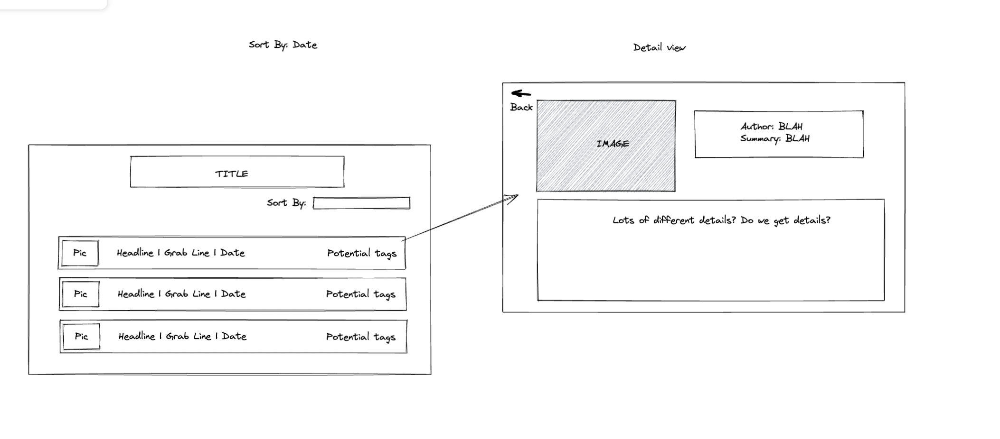
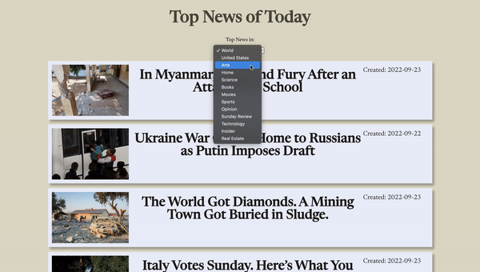
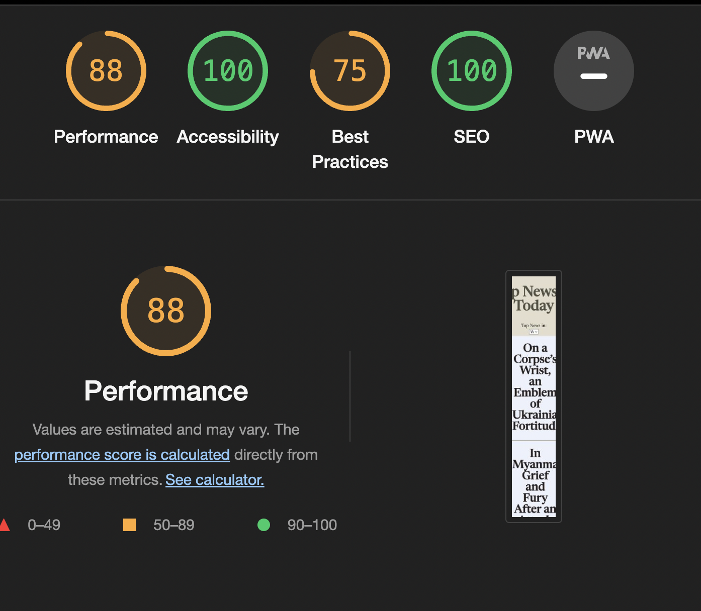

Top News Today
## Table of Contents

- [Technologies](#technologies)
- [Set Up](#set-up)
- [Features](#features)
- [Contributors](#contributors)
- [Project Specifications](#project-specifications)

### Technologies
- JavaScript
- React
- Cypress
- React-Router
- HTML
- CSS

### Set Up
1. Clone this [repository](https://github.com/BlueNealis/take-home-news).
2. `cd` into the directory.
3. Run `npm i install`.
4. Run `npm start`.

### Wireframe

### Features
- User can scroll and see headlines of top news from the NY Times
- User can click on article to get more details
- User can redirect to full article from detail page

- User can go back to main page from detail page

- User can select different type of news topics

- 100% Accessibility on lighthouse

### Contributors

- [Blue Nealis](https://github.com/BlueNealis/)[LinkedIn](https://www.linkedin.com/in/blue-nealis/)

### Project Specifications
- Project specs are located [here](https://mod4.turing.edu/projects/take_home/take_home_fe).
